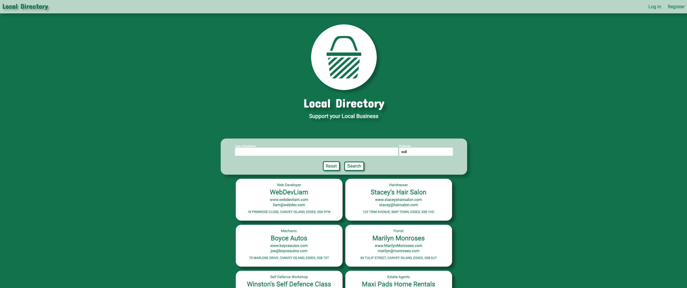

Local Directory App Project
==========================

**Website** - [Local Directory](https://local-directory.herokuapp.com/)

The sole goal of the Local Directory App is to bring indepentantly owned local businesses to its users. 
Users will be able to search for a sepcific type of business in their area from the Local Directory App's Database and the app will return its results. 
Users can also register their own business, update that information and even delete it from our database should they want to. 

UX
====
Upon accessing the Local Directory App, the user will be able search for any type of business they are looking for as well as Sign in or Register a business. 

The homepage consists of a navigation bar with the option to login or register a business., below that is the Local Directory logo, the Search tool and a default list of "business cards".

If the user wants to search for a specific business, all they need to do is enter the type business they want and their postcode then click the "Search" button. The app will then return results of the search to the User, with a list of Business Cards. Priority Business Cards will be displayed at the top. 

Each business card displays the following;
Type of Business
Name of Business
Website
Email
Address

The user can also Log In or Register a business, using the navbar to navigate to the register page or Login page. 

Once the User has Logged In or Registered, the navbar changes so the User can view thier profile page as well as log out. 

On the Profile page the User will be able to Edit/Update the business information they have registered, they will be redirected to the edit information page for that specific business where they can update this information.
The user will also have the option to delete their business and Profile from the database.
 

User Stories
----------------

- As a User, I would like a Navigation Bar, so I can navigate the App.
- As a User, I would like the Navigation Bar to take me to the Register page. 
- As a User, I would like the Navigation Bar to take me to the Log In page.
- As a User, I would like the Navigation Bar to take me to Index page. 
- As a User, I would like the Local Directory logo to take me to the Index page.

- As a User, I would like a Search Tool, so I can search the database for a specific business in my area. 
- As a User, I would like a Search Button so I can search the database.
- As a User, I would like there to be a reset button on the search tool, should I want to start my search again. 

- As a User, once I have clicked search, I would like the relevant businesses to be displayed for me to view on a business card. 
- As a User, I would like to be able to click on the website link on the business cards.
- As a User, I would like to be able to click on the email link on the business cards.

- As a User, I would like to Register my business to the Local Directory Database.
- As a User, when I am registering I would like a flash message to show if a username already exists on the databse. 
- As a User, when I am registering I would like a flash message to show if the passwords don't match when I verify. 
- As a User, when I am registering I would like a flash message to show if an email already exists on the database. 
- As a User, when I am registering I would like a flash message to show if the emails don't match when I verify.  
- As a User, I would like a flash message that tells me I have successfully registered.

- As a User, once I am registered I would like a Profile page specific to me.

- As a User, I would like to be able to Log In to my profile on the app. 
- As a User, when I am logging in, I would like a flash message to show if the username or password doesn't match on the database.
- As a User, I would like a flash message to show I have successfully Logged In. 
- As a User, I would like the profile page to display the business I have registered. 
- As a User, I would like the Navigation Bar to take me to my Profile page, once I am logged in.
- As a User, I would like the Navigation Bar to allow me to log out of my Profile on the App.
- As a User, I would like a flash message that tells me I have successfully been logged out. 
- As a User, I would like to be able to update my business information on my Profile page. 
- As a User, I would like a Cancel button incase I don't want to update my business information.
- As a User, I would like a flash message that tells me I have successfully updated my information. 
- As a User, I would like to be able to Delete my Business and Profile from the database. 
- As a User, I would like the app to check 'Are you sure?' before deleting, incase I dont want to. 
- As a User, I would like a flash message that tells me I have successfully been removed from the database. 

- As a User, I would like a convienent link at the bottom of the Log In page that takes me to the Register page, incase I have mistakenly clicked the wrong link. 
- As a User, I would like a convienent link at the bottom of the Register page, that takes me to the Log In page, incase I have mistakenly clicked the wrong link. 

Wireframe
--------------
I used Adobe Photoshop to create wireframes in desktop, tablet and phone view.
[Link](mock_ups)

Features
======

**Existing Features**
----------------------
Navigation Bar
------------
All 6 pages have a navigation bar at the top of the page that is fixed so that it's acessible at all times whilst the user is using the app. The bar is opaque white, consisting of a green logo of the web app that directs you to index page. The Navigation links change depending on if the user is registered and logged in. Without a logged in user the nav bar consists of links to the log in page and register page. If a user is logged in, the nav bar changes to a link for the users profile and to log out of the web app. 

If the user is the Admin, the profile link is specifically replaced with the admin page. 

Centered on the page is a the Local Directory logo along with the web apps name identical to that on the navigation bar, in which the user is able to click on it to redirect the user back the index page from anywhere on the app. 

Index Page
----------
All the information is displayed on the centre of the page. The search tool allows the User to search and browse a list of business cards, which are displayed beneath the search tool.

Results Page
----
When the User searches for a business, the 'Local Directory' title is removed from where it was displayed underneath the logo, this is to condense and simplify the layout.
After a User search, Business Cards are displayed in order of relevance. 

Log in Page
----
When the User clicks the 'Log In' button, the title of the page becomes 'Log In', positioned underneath the logo. Below this is a log in form, for the User to log into their Profile. The Log in form consists of 2 parts; Username and Password. 

At the bottom of the page there is a link for the registration page. 

Register Page
------
 When the User clicks the 'Register' button, the title of the page becomes 'Register', positioned underneath the logo. Below this is a registration form, for the User to create their Profile and Business Card. The Log in form consists of 9 parts; 

 - Username
 - Password
 - Verify password
 - Name of Business
 - Type of Business
 - Website
 - Business email
 - Verify Business email
 - Address

 At the bottom of the page there is a link for the log in page.

Profile Page
-----
Once the User is on the 'Profile' page, the title of the page becomes the User's username followed by 'Profile', positioned underneath the logo. This is intended to add personalisation for the User. Below the title is the Business card associated with the User.

At the bottom of the page are 2 buttons;

- Update your business information
- Delete profile and business information

The Update button allows the User to update their business information.

The Delete button allows the User to completely remove their profile and business from the database. Before the profile and business are deleted the app prompts a Modal to check the User is sure they want to delete. If the User proceeds to delete, they are logged out and redirected to the index page.

Update Information Page
-----
Once the User is on the 'Update your business information' page, the title of the page becomes 'Edit business information', positioned underneath the logo. Below the title is a edit form for the User to use to change any information associated with their registered business. The form is automatically filled with the User's existing information. The form has 6 parts;

- Name of business
- Type of business
- Website
- Business email
- Verify business email
- Address

At the bottom of the page are 2 buttons; Cancel and Update.

The 'Cancel' button redirects the User back to their profile page with no changes made to the business information.
The 'Update' button applies the changes made to the edit form on the database then redirects the User back to their profile.

Search Tool
--------
The search tool can be used by entering a 'Type of Business' and a 'Postcode'. This is so the User can find a specific business in a specific area. The User can search by 'Postcode' only but not by 'Type of business' only.

There are 2 buttons underneath the input fields; Search and Reset.

Search - executes the User's search.
Reset - resets the input field by redirecting and reloading the index page.

Once the User has clicked 'Search' the relevant business cards are displayed at the bottom of the page.

Business Cards
------
All business cards display the following information;

- Type of Business
- Name of Business
- Website
- Email
- Address

The user is able to click the links on both the Website and Email, where the user will then be redirected to the website or prompted to compose an email. 

Admin Page
------------
Once the Admin User is on the 'Admin' page, the title of the page becomes 'Admin Profile', positioned underneath the logo. This is intended to add personalisation for the Admin User. Below the title is an input field that allows the Admin User to add a 'Type of Business', below this is an 'Add' button. 

Add - allows the Admin User to add Business categories to the database.

Flash Message
--------
Flash messages are shown when any signifcant action has been carried out by the user. 

When Registering a business, the flash messages the User could see are;  

- Username already Exists
- Email already exists
- Password verification doesn't match 
- Email verification doesnt match 

When Logging In, the flash messages the User could see are; 

- Username or Password already exists

When on the Profile page, the flash messages the User could see are;  

- Welcome message 
- Information was successfully updated

When on the Index page, the flash messages the User could see are; 

- Log out confirmation
- Profile and business was deleted

Style and Theme
---------
The design of the app primarily uses a consitent colour theme of Green and White, with white sometimes being opaque to create seperation from other features on the page. Red is used as a warning sign when trying to delete the busienss and profile. 

The app's search tool has a search engine specific feel in it's layout, which should be familiar for Users. 

Beveled edges on the forms, search tool and busienss cards are all consistently implemented as well as drop shadows to give the look a more dynamic pop off the page feel. 

The app is designed to be simple, with many features self explanatary making it intuitive and easy to use for the User.

All is information on the pages is presented centraly and easy on the eyes. 

Features To Be Implmented
---------------------------------------
- Google Map API for the address of each business
- Static Profile Page for each business a user can observe. 

Technologies Used
=============

[HTML](https://html.com) - The project uses HTML to create the pages of the app.

[CSS](https://www.w3.org/Style/CSS) - The project used CSS to style the app.

[JavaScript](https://www.javascript.com) - The project used JavaScript to apply animation to the app.

[Python](https://www.python.org) - The project user Python to run the app. 

[Google Fonts](https://fonts.google.com) - The project used this for a font on the app.

[jQuery](https://jquery.com) - The project used this library to manipulate and animate the site. 

[Git](https://git-scm.com) - The project uses Git to push the project on to the Github repository.

[GitHub](https://github.com) - The project uses GitHub repository to store the app.

[Heroku](https://www.heroku.com) - This project uses Heroku to host the app.

[MongoDB](https://www.mongodb.com) - This project uses MongoDB database service for the app. 

[Gitpod](https://gitpod.io) - The project uses Gitpod IDE to facilitate building the app.

[Validator](https://validator.w3.org) - The project used this website to validate the HTML for the app.

[Jigsaw](https://jigsaw.w3.org/css-validator/) - The project used this website to validate the CSS for the app.

[JShint](https://jshint.com) - The project used this website to validate the JS for the app. 

[PEP8 Online](http://pep8online.com) - The project used this website to validate the Python for the app.

[Adobe Photoshop](https://www.adobe.com/uk/products/photoshop.html) - The project used this software to design the layouts and logo for the app.

Testing
======

Is on a seperate document - [testing.md](testing.md)

Deployment
==========

Heroku was used to deploy this app, in order to do this you will need to take the following steps;

**Create Heorku App**
------------
>1. Go to the Heroku website log in/sign up.
>2. Go to your app daskboard and click the "Create new app" button.
>3. Choose a unique app-name and choose a region, ideally closest to your location.
>4. To install Heroku, go to your command line and enter **npm install -g heroku**.
>5. You will now need to Log In to heroku from the command line,  enter **heroku login -i** 
>6. Follow the instructions prompted by entering your username and password, your app should now be deployed to heroku.

**Connect Git Remote**
--------------
You will now need to connect to your repository.
>7. Retrieve the **Heroku GIT URL** from the **Settings** tab on your Heroku Dashboard.
>8. Go to your command line and enter **git remote add heroku https://git.heroku.com/local-directory.git**

**Add requirements.txt File**
--------------
>9. In the command line enter **pip3 freeze --local > requirements.txt** 

**Add Procfile**
---------
>10. In the command line enter **echo web: python run.puy > Procfile**

Creating both **requirements.txt** and **Procfile** you should now be able to successfully push the repository to Heroku successfully. 
>11. in the Command line enter **git push -u heroku master**

**App Configuration**
----------
>12. Configurations needed in your app.py or env.py files will need to be added in the **Config Vars** section located in the **Settings** tab on your dashboard.
For this app -

- IP
- MONGO_DBNAME
- MONGO_URI
- PORT
- SECRET_KEY

>13. You should now be able to view and use the Local Directory app - https://local-directory.herokuapp.com/ **HAZAR!** 

Running Code Locally
----------------------------
>1. Go to GitHub Repositry. -https://https://github.com/liamoconnor87/local_directory
>2. Click on the **Clone or Download** button in **green** and copy the URL link to the repository in the address box - https://github.com/liamoconnor87/local_directory.git
>
>3. Head into your terminal and **cd** to the path where you would like to clone the repository.
>4. Type - **git clone https://github.com/liamoconnor87/local_directory.git**. This should download your repository to your designated folder.
>5. Once this is downloaded, you can run the files through your browser to check it works.

Credits
======

Content
-----------
- The apps functionality came from the [Code Institute - Data Centric Development Module] on (https://codeinstitute.net)

Media
--------
- All images were created by the developer. 

Acknowledgements
--------------------------
- I took inspiration from the current problems local businesses are under, durring the global pandemic.
- I received mentorship on this project from Antonio Rodriguez.