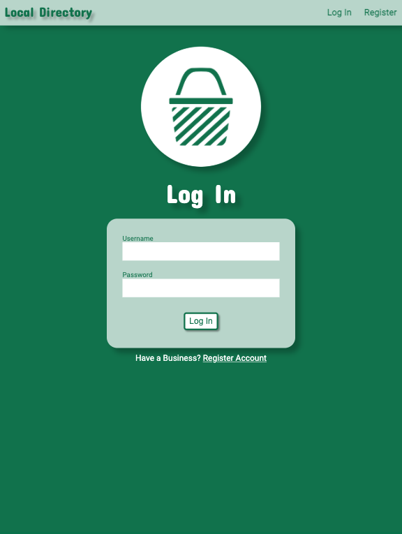
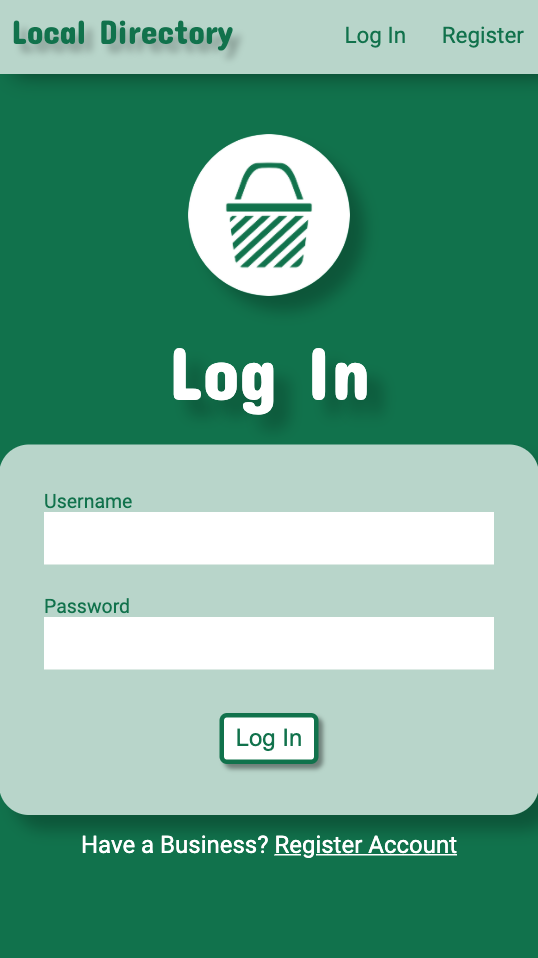
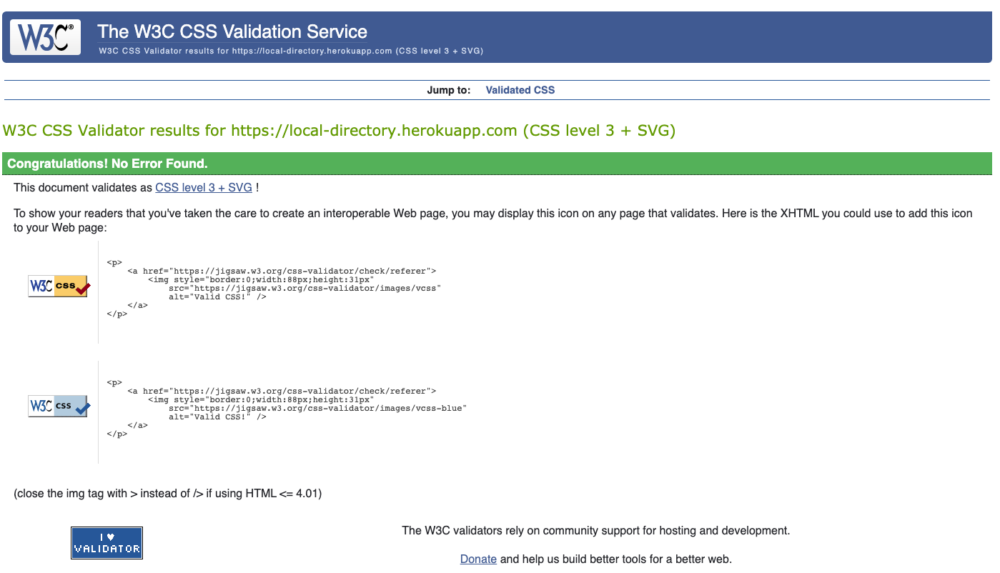

Testing
======
**User Story Testing**
-------

*As a User, I would like a Navigation Bar, so I can navigate the App.*
------------------
- When a User visits the page and starts using the App, the navigation bar is positioned at the top of every page.

Steps taken - 
>Go to the Local Directory App Website - https://local-directory.herokuapp.com

>Observe that the Naivgation Bar is at the top of the page. 

>Navigate the site to confirm the navigation bar is displayed. 

*As a User, I would like the Navigation Bar to take me to the Register page.*
---------
- When the User, clicks on Register link in the navigation bar, the User should be redirected to the Register page. 

This testing also applies to these User Stories - 

***As a User, I would like the Navigation Bar to take me to the Log In page.***

***As a User, I would like the Navigation Bar to take me to Index page.***

***As a User, I would like the Local Directory logo to take me to the Index page.***

***As a User, I would like the Navigation Bar to take me to my Profile page, once I am logged in.***

***As a User, I would like the Navigation Bar to allow me to log out of my Profile on the App.***

***As a User, I would like a flash message that tells me I have successfully been logged out.***

Steps taken - 
>Click on the Register link on the navigation bar.

>Observe that the link takes you to the Register page.

>Repeat for the Log In link.

>Repeat for the Index link by clicking the 'Local Directory' title in the navigation bar.

>Repeat for the Index link by clicking the Local Directory logo below the navigation bar.

>Repeat for the Profile link.

>Repeat for the Log Out link.

>Observe the app redirects me to the Index Page and a flash message appears confirming logging out was successful. 

*As a User, I would like a Search Tool, so I can search the database for a specific business in my area.*
------

- The search tool is accessbile from the index page and results page.
- The User can enter a type of business and post code. 
- The User will be able to search the databse by clicking the 'Search' button.
- The User will be able to reset the search by clicking the 'Reset' button
- Hovering over the each button, changes its appearance. Combinations of Green and White.
- Clicking Search the business cards will be displayed underneath the search tool in relevant order.  

This testing also applies to these User Stories -

***As a User, I would like a Search Button so I can search the database.***

***As a User, I would like there to be a reset button on the search tool, should I want to start my search again.***

***As a User, once I have clicked search, I would like the relevant businesses to be displayed for me to view on a business card.***

Steps taken - 
>Observe that the search tool is available on the index page.

>Type a business type in the first input field.

>Type a post code in the second input field.

>Move mouse over the 'Search' button and observe it changes colour. 

>Move mouse over the 'Cancel' button and observe it changes colour.

>Cick the 'Search' button and observe the relevant businesses being displayed. 

>Observe that the search tool is available on the results page. 

>Click the 'Reset' button to confirm the search has been reset. 

 
*As a User, I would like to be able to click on the website link on the business cards.*
------------
- Each business card will have a website listed in its information. 
- Hovering the mouse over the website will underline the website address. 
- Clicking on the website will redirect the user to that website on another page.

This testing also applies to this User Story-

***As a User, I would like to be able to click on the email link on the business cards.***

Steps taken - 
>Move mouse over the website link and observe the address is underlined. 

>Click on the website link and observe you are redirected to that website on another page.

>Repeat this for the email link. This should prompt your device to try and compose an email. 

*As a User, I would like to Register my business to the Local Directory Database.*
-----------

- A new User will be able to register a business by going to the Register page.
- Registration form is displayed for the User to fill in. 
- Each field is required to be filled.
- Username and Buiness email must be unique. 
- Password verification is required. 
- Email verification is required.
- Hovering the mouse over the 'Register' button changes its appearance. Combinations of Green and White. 
- Should the User realise they already have registered, there is a link at the bottom of the page that redirects the User to the Log In page. 
- Upon clicking the 'Register' button the user will be redirected to their Profile page.
- Flash message is displayed on the Profile page that Registration was successful. 

This testing also applies to these User Stories -

***As a User, when I am registering I would like a flash message to show if a username already exists on the databse.***

***As a User, when I am registering I would like a flash message to show if the passwords dont match when I verify.*** 

***As a User, when I am registering I would like a flash message to show if an email already exists on the database.*** 

***As a User, when I am registering I would like a flash message to show if the emails dont match when I verify.***  

***As a User, I would like a flash message that tells me I have successfully registered.***

***As a User, I would like a convienent link at the bottom of the Register page, that takes me to the Log In page, incase I have mistakenly clicked the wrong link.*** 

***As a User, Once I am registered I would like a Profile page specific to me.***

Steps taken - 

>Go to the Register Page.

>Fill in the form.

>Move mouse over the 'Register' button and observe it changes colour.

>Observe a prompt to complete the form if an input field is empty upon clicking 'Register'.

>Observe a flash message appears when a username already exists upon clicking 'Register'.

>Observe a flash message appears when a email already exists upon clicking 'Register'.

>Observe a flash message appears when the passwords dont match for verification upon clicking 'Register'.

>Observe a flash message appears when the emails dont match for verification upon clicking 'Register'.

>Upon filling the register form correctly, click the 'Register' button and observe the app redirects the User to their personal Profile page. 

>Observe a flash message confirming registration was successful. 

*As a User, I would like to be able to Log In to my profile on the app.*
--------------

- A User will be able to Log into their Profile by using the Log In page.
- Log In form is displayed for the User to fill in.
- Each field is required to be filled.
- Hovering the mouse over the 'Log In' button changes its appearance. Combinations of Green and White.
- Username and password must be correct.
- Should the User realise they dont have a registered business, there is a link at the bottom of the page that redirects the User to the Register page. 
- Upon clicking the 'Log In' button the user will be redirected to their Profile page.
- Flash message is displayed on the Profile page that Log In was successful.

This testing also applies to these User Stories -

***As a User, when I am logging in, I would like a flash message to show if the username or password doesnt match on the database.***

***As a User, I would like a flash message to show I have successfully Logged In.***

Steps taken - 
>Go to the Log In Page.

>Fill in the form.

>Move mouse over the 'Log In' button and observe it changes colour.

>Observe a prompt to complete the form if an input field is empty upon clicking 'Log In'.

>Observe a flash message appears when a username or password doesnt match upon clicking 'Log In'.

>Upon filling the log in form correctly, click the 'Log In' button and observe the app redirects the User to their personal Profile page. 

>Observe a flash message confirming logging in was successful.

*As a User, I would like the Profile page to display the business I have registered.*
------------

- Profile page will display the Users registered business.
- Profile page provides the ability to update the business information.
- Profile page also provides the ability for the User to delete their Profile and registered business.
- Hovering the mouse over changes the appearance of the 'Update your Business Information' button. Combinations of Green and White.
- Hovering the mouse over changes the appearance of the 'Delete Profile and Business Information' button. Combinations of Red and White.
- Clicking to update redirects the User to the edit buisness information page.
- Clicking to delete prompts the User with a Modal asking if they are sure.
- Apon clicking to Update there information, the User is redirected to the Edit Business Information page.
- Edit Business Information form is displayed for the User.
- Each field is required to be filled.
- Each field is automatially filled with the exisiting information.
- Hovering the mouse over changes the appearance of the 'Cancel' button. Combinations of Green and White.
- Hovering the mouse over changes the appearance of the 'Update' button. Combinations of Green and White.
- Email verification is required.
- Clicking the 'Update' button updates the buisness information on database and redirects the User back to the Profile page.
- Clicking the 'Cancel' button redirects the User back to the Profile page. Business Information unchanged.

This testing also applies to these User Stories -

***As a User, I would like to be able to Update my business information on my Profile page.***

***As a User, I would like a Cancel Button incase I dont want to Update my business information.*** 

***As a User, I would like a flash message that tells me I have successfully updated my information.***

***As a User, I would like to be able to Delete my Business and Profile from the database.*** 

***As a User, I would like the app to check 'Are you sure?' before deleting, incase I dont want to.*** 

***As a User, I would like a flash message that tells me I have successfully been removed from the database.***

Steps taken - 

>Observe the Users business is displayed on the Profile page.

>Move mouse over the 'Update your Business Information' button and observe it changes colour. 

>Move mouse over the 'Delete Profile and Business Information' button and observe it chnages colour.

>Click on the 'Update your Business Information' button and observe it redirects you to the Edit Information page.

>Observe the Edit Information form is displayed.

>Move mouse over the 'Update' button and observe it changes colour.

>Move mouse over the 'Cancel' button and observe it changes colour.

>Observe the pre exisiting information has filled the form.

>Observe a prompt to complete the form if an input field is empty upon clicking 'Update'.

>Observe a flash message appears when a email already exists upon clicking 'Update'.

>Observe a flash message appears when the emails dont match for verification upon clicking 'Update'.

>Click the 'Update' button, observe the user has been redirected back to their Profile page, and that the information has been updated.

>Observe a flash message confirming the information has been updated.

>Navigate to Edit Information page. Click the 'Cancel' button, observe the user has been redirected to the Profile page and no business information has been changed.

>Click the 'Delete Profile and Business Information' button and observe the 'Are you sure?' Modal appears.
 

>Move mouse over the 'Yes, Delete Me!' button and observe it changes colour.

>Click the 'Cancel' button to confirm the Modal disappears and User is back on their Profile page.

>Click the 'Yes, Delete Me!' button. Observe the User and Business be deleted. User redirected to the index page.

>Observe a flash message confirming User and Business have successfully been deleted.

**Browser Compatibility**
---------------------------------------

The app is compatible on the following browsers - 

- Chrome
- Opera
- Vivaldi
- Safari
- Firefox
- Microsoft Edge

However on some smart devices, margins between headings are removed. Changing the appreance slightly. 

**Layout responsiveness**
---------------------------------------

Responsive layout was primarily tested on Chrome and Vivaldi using the Developer Tools. 
The website also worked well with Microsoft Edge, Internet Explorer, Safari and Firefox.
The website also works well with smart devices.

## Desktop View's ##

>**Homepage**

>

>**Search Results**

>

>**Log In**

>

>**Register**

>

>**Profile**

>

>**Update Business**

>

>**Delete Modal**

>

## Ipad Pro View's ##

>**Homepage**

>

>**Search Results**

>

>**Log In**

>

>**Register**

>

>**Profile**

>

>**Update Business**

>

>**Delete Modal**

>

## Ipad View's ##

>**Homepage**

>

>**Search Results**

>

>**Log In**

>

>**Register**

>

>**Profile**

>

>**Update Business**

>

>**Delete Modal**

>

## Smart Phone View's ##

>**Homepage**

>

>**Search Results**

>

>**Log In**

>

>**Register**

>

>**Profile**

>

>**Update Business**

>

>**Delete Modal**

>

**Bugs and Problems**

- One noteable bug I noticed, on some smart phone's the margin to serperate the logo header and forms is removed. 

Automated checks
================

I used the W3C's Validators to check my HTML and CSS code. Here are the steps I took.

>**HTML**

>

>**CSS**

>

1. **Using the websites URL address to check the HTML code**

>1. Go to https://validator.w3.org and select the URI tab. 

>2. Enter http://local-directory.herokuapp.com into the address bar and click **Check**.

>3. Confirm that no errors show.

***Note: Warnings show for section lacking header and considerations for h1 elements to be top level. Business Cards show a small business category heading at top followed by a larger heading for the business name. I prefered this visually.***

Repeat process for these pages. 

>4. Enter http://local-directory.herokuapp.com/login.html into the address bar and click **Check**.

>5. Confirm that no errors show.

***Note: Warnings show for section lacking header and considerations for h1 elements to be top level. Business Cards show a small business category heading at top followed by a larger heading for the business name. I prefered this visually.***

>6. Enter http://local-directory.herokuapp.com/register.html into the address bar and click **Check**.

>7. Confirm that no errors show.

***Note: Warnings show for section lacking header and considerations for h1 elements to be top level. Business Cards show a small business category heading at top followed by a larger heading for the business name. I prefered this visually.***

The **Results**, **Profile** and **Update Business** pages are all generated based on the users actions.
To test these pages I had to do the following. 

>8. Go to https://local-directory.herokuapp.com and click the *Search* button to create a search page.

>9. Once generated I opened the page in the Browser's DevTools by right clicking on page and selecting *Inspect*.

>10. Highlight and copy the HTML code in the Elements tab.

>11. Go to https://validator.w3.org and paste the code into the Direct Input tab once selected.

>12. Confirm that no errors show.

***Note: Warnings show for section lacking header and considerations for h1 elements to be top level.***

>13. Repeat process 9 - 12 for the Profile page.

>14. Confirm that no errors show.

***Note: Warnings show for section lacking header and considerations for h1 elements to be top level.*** 

>15. Repeat process 9 - 12 for the Update Business page.

>16. Cofirm that no errors show.

***Note: Warnings show for section lacking header and considerations for h1 elements to be top level.***

2. **Using the websites URL address to check the CSS code**

>1. Go to https://jigsaw.w3.org/css-validator/ and select the URI tab. 

>2. Enter https://local-directory.herokuapp.com into the address bar and click **Check**.

>3. Confirm that no errors show. 

I used JShint to validate my Javascript code. Here are the steps I took. 

>**JS**

>

3. **Input directly to check JS code.**

>1. Go to the repository - https://github.com/liamoconnor87/local_directory

>2. Navigate to the **scripts** folder within the **static** folder and select **script.js**.

>3. Click on the **script.js** file link. This should take you to script.js page displaying the code. From here you can highlight all the code and copy it. 

>4. Once copied, go to https://jshint.com.

>5. Paste the code from the script.js file in to where instructed.

>6. Validation works automatically, confirm no errors.

>**Python**

>

3. **Input directly to check Python code.**

>1. Go to the repository - https://github.com/liamoconnor87/local_directory

>3. Click on the **app.py** file link. This should take you to app.py page displaying the code. From here you can highlight all the code and copy it. 

>4. Once copied, go to http://pep8online.com.

>5. Paste the code from the app.py file in to where instructed.

>6. **Click** Check code to confirm no errors.

=======

**Admin User Story Testing**
=======
*As a User, I would like the Navigation Bar to take me to my Admin page, once I am logged in.*
------

- Admin page can only be accessed using the Admin Log In details through the Log In page. 
- When the User, clicks on Admin link in the navigation bar, the User should be redirected to the Admin page.
- User is able to *Add a type of Business* to the Database. 
- Flash message appears confirming Business Type has been added. 

Steps taken - 
>Click on the Admin link on the navigation bar.

>Observe that the link takes you to the Admin page.

>Enter a type of Business and click the *Add* button. 

>Observe the flash message confirming category has been added.

## Desktop View's ##

>

## Ipad Pro View's ##

>

## Ipad View's ##

>

## Smart Phone View's ##

>

Automated check
======
As this is also a page generated by the User's actions. I had to carry out the same method as I did with the *Profile* page.

Steps taken - 
>1. Once generated I opened the page in the Browser's DevTools by right clicking on page and selecting *Inspect*.

>2. Highlight and copy the HTML code in the Elements tab.

>3. Go to https://validator.w3.org and paste the code into the Direct Input tab once selected.

>4. Confirm that no errors show.
